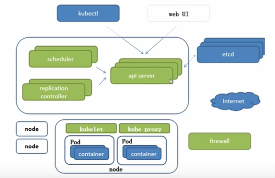

# Tutorial

[kubernetes official document](https://kubernetes.io/docs/tutorials/)

## hello minikube

## basics

### cluster

a kubernetes cluster consists of two type of  resources:

* the *Control Plane* coordinates the cluster
* *Nodes* are the workers that run the applications
  * a node is a VM or a computer that serve as a worker machine in the cluster
  * each node has a *Kubelet*, which is an agent for managing the node and communicating with the Kubernetes control plane

`kubectl get nodes` to see the nodes in the cluster

### deployment & pod

A *deployment* is responsible for creating and updating instances of your application

once the application instances are created, a Kubernetes Deployment Controller continuously monitors those intances.

self-healing mechanism to address machine failure or maintenance

> if the nodehosting an instance goes down or deleted, the Deployment controller replaces the instance with an instance on another Node in the cluster

*Pod* is a Kubernetes abstraction that represents a group of or one or more application containers (like Docker), and some shared resources for those containers:

* shares storage, as Volumes
* networking, as a unique cluster IP address
* information about how to run each container, such as image version or port

a *Pod* models an application-specific "logical host" and can contain different application containers which are relatively tightly coupled

*Pod* is the atomic unit on Kubernetes platform

when we create a Deployment in K8S, the Deployment creates Pods with containers inside them

in case of a Node failure, indentical Pods are schedules on other available Nodes in the cluster

### node

Kubernetes master automatically handle scheduling the pods and pods across the Nodes in the cluster

every Kubernetes Node runs at least:

* Kubelet, a process responsible for communication between Kubernetes Master and the Node, it manage the Pods and the containers running on a machine
* A container runtime responsible for pulling the container image from registry, unpacking the container and running the application

### service

# bilibili

## introduction

### borg

BorgMaster：保证奇数个结点（防止脑裂）

将命令分发到对应的Borglet：scheduler将数据写入persistent store（Paxos：键值对数据库），Borglet将持续监听Paxos

Borglet

#### k8s

scheduler将任务分发到不同node：scheduler将任务给api server，api server将任务写到etcd（分布式键值数据库，存储k8s集群所有重要信息）

api server：一切服务访问的入口

replication controller控制副本数，将pod数维持在期望值

kubelet维持pod生命周期（通过container runtime interface与docker交互）

kube proxy负责写入规则至iptables、ipvs，实现服务映射访问port，操作firewall

### 其他

coreDNS：可谓集群中service创建域名IP的对应关系解析

dashboard

ingress：可以实现七层代理，可以根据域名实现负载均衡

fedetation：提供一个可以跨集群中心多k8s统一管理

prometheus：提供k8s集群监控能力

elk：提供k8s集群日志统一分析接入

## Pod

* 自主式pod（无法被重启、恢复副本等）
* 控制器管理的pod

  * Replication controller（保证容器应用的副本数/Pod数始终保持在期望值，新版本中k8s建议使用ReplicaSet取代RC）、ReplicaSet（相较于RC支持集合式selector）、Deployment（一般建议用Deployment来自动管理RS，可以支持rolling-update）

    * 滚动更新旧的RS不会删除以实现回滚
  * HPA：horizontal pod autoscaling。根据pod的CPU利用率扩容，支持根据内存和用户自定义的metric扩缩容。HPA基于RS定义
  * StatefulSet为了解决有状态服务的问题

    * 稳定持久化存储。pod重新调度后还能访问到相同持久化数据，基于PVC
    * 稳定网络标志。pod重新调度后podname和hostname不变，基于headless sevice（没有cluster ip的service）实现
    * 有序部署，有序扩展。前面所有pod必须是running和ready状态。基于init container实现
    * 有序收缩，有序删除。从后往前
  * DaemonSet保证node上运行一个Pod的副本。删除DaemonSet会删除它创建爱你的所有Pod
  * Job负责批处理任务，保证批处理任务的一个或多个Pod成功结束
  * CronJob管理基于时间的Job

    * 在给定时间只运行一次
    * 周期性运行

在pod创建时启动pause容器，pod内其他容器共用pause的ip和存储卷（同一pod中容器port不能冲突）

## 网络通讯方式

假定了所有Pod都在一个可以之间连通的扁平的网络空间（都可以直接通过IP直接到达）

# question
